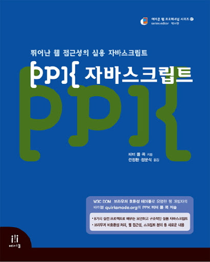

 
발간된지 꽤 된 책인데, 당근마켓에서 자바스크립트 서칭을 하다가 찾아낸 책이다. 목차를 보니 웹과 브라우저, 쿠키까지 그리고 이벤트 핸들링과 관련된 목차가 많아서 구매를 선택했다.  

웹에대한 근간을 배우는데 도움이 되는 책이다. 자바스크립트만이나 리액트만 알려주는 도서는 많지만 브라우저 자체에 대해 상세한 설명을 해주는 도서는 많지 않기때문에 웹에 대해 배우고 싶다면 한번쯤은 읽어봐도 괜찮은 책이다. 이벤트 핸들링에 대해 상세하게 기술되어있어서 어떻게 동작하는지 자체를 잘 알수있고 이벤트 버블링에 대한 설명도 상세하게 기술되어있다. 퍼블리셔일때 읽었다면 도움을 아주 많이 받았을 것 같다. 실제로 이 책의 기존 주인 분도 퍼블리셔였다. 그러면서 웹접근성에서도 설명해주고 있기때문에 웹 개발을 하며 놓치기 쉬운 부분까지 짚어주고 있다.   

다른 책에는 개념만 한번 넘어가고 말았았거나 아이 설명이 없었던 윈도우객체나 doccument, navigater, location, history 등의 설명도 자세하다. 프론트엔드여도 놓쳐선 안될 부분 같다.   

이벤트 쪽 설명은 출판된지 좀 된 책이라서 그런지 좀 다르긴하고 익스 웹 부라우저에 대한 분기처리 내용이많으나, 이젠 마이크로소프트사도 크로미움 웹 브라우저로 바뀌면서 해당되지 않는 내용도 좀 있었다. 그러나 이벤트에 대한 기본 성질은 같다. 기존의 웹 개발자들은 통일되지 않은 브라우저 때문에 스크립트 개발하는데 더 애를 먹었을것 같다.   

과연 웹기술은 빠르게 변하지만 그 근본은 변하지 않았다고 생각이 든 책이었다.

   
