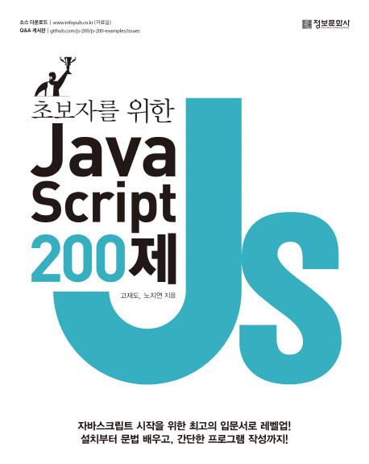

 
2019년에 발간된 책. 요즘은 책으로 공부하는 것에 흠뻑 빠져있다. 나도 놀랄만큼 빠르게 책을 공부해 나가고 있다. 날 거쳐간 책 중 하나도 이 책이다. 
이 책 또한 당근마켓에서 자바스크립트 서치를 하다가 발견하게되서 구매하였다. 목차를 보고 기본기를 꼼꼼하게 다져볼 수 있을 것 같아서 구매하였다. 

200제 라는 제목에 걸맞게 자바스크립트를 하나하나 순서대로 기초부터 중급까지 찬찬히 훑어볼 수 있어서 좋았던 책 같다. 책의 구성이 매우 맘에 들었다.
es5부터 es6에선 어떻게 쓸 수 있는지 비교가 되며 나와있고, 한가지 영역에서 심화까지 가는 구성이 특히나 마음에 들었다. 그 중 제일 좋았던것은 클로져나 비동기 처리에 관련된 문제였었다. 그 부분에 대해서 곧 포스팅을 할 예정이다. 

자주쓰는 메소드들은 죄다 싹 정리가 되어있어서 이 책 한권만 열심히 독파해도 왠만한 자바스크립트 메소드는 다 쓸줄 알게 될것이고, 돔, 이벤트, 버블링 등 윈도우와 웹에 관련된 내용도 응용 파트에서 모두 정리가 되있어서 한권으로 공부하기에 딱 좋은 책같다. 초보자, 중급자 할것없이 한번쯤 읽어보면 매우 도움이 될 책이다. 특히나 자바스크립트 초보자에겐 더할나위없이 좋은것 같은데, 사내에 추천도 해 볼 예정이다. 좋은 책을 보아서 좋았다.  

윈도우간 이벤트처리, 아이프레임 이벤트처리, 커스텀 이벤트처리, 그리고 비동기 통신 처리까지 확실하게 배우기 애매했던 것들을 이번에 배우면서 직접 현재 개발하고 있는 사내 소스와 비교해가며 공부해보았다. 이제는 애매했던 부분이 확실하게 그림이 그려지는 느낌이다. 실력이 쌓여가는 느낌이라 뿌듯하다.  
다음 책은 타입스크립트 프로그래밍이다. 또 열심히 달려보자.
   
